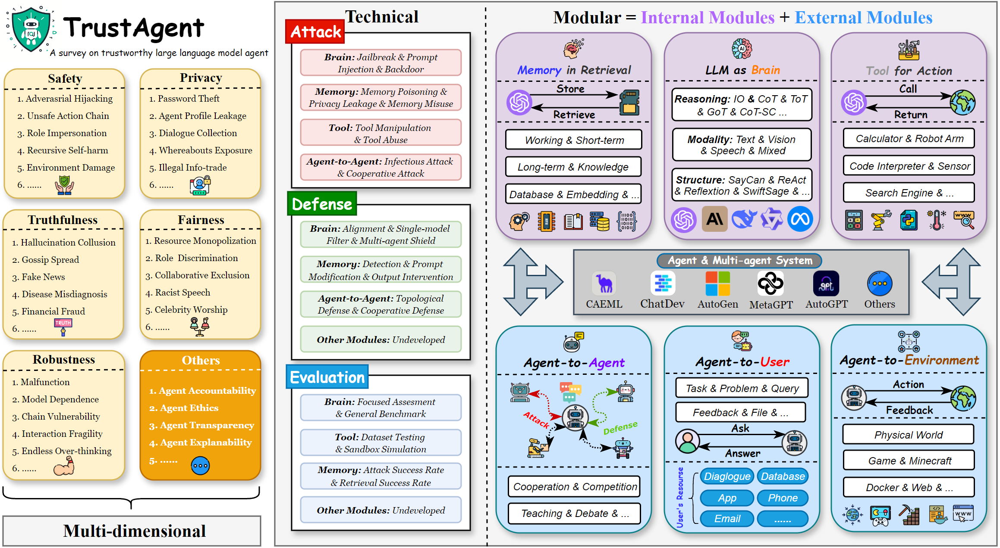

# TrustAgent: A Survey on Trustworthy LLM Agents

## 📌 Introduction
With the rapid evolution of Large Language Models (LLMs), LLM-based agents and Multi-agent Systems (MAS) have significantly expanded the capabilities of AI ecosystems. However, this advancement has introduced more complex trustworthiness issues. This repository provides an overview of our survey paper **"A Survey on Trustworthy LLM Agents: Threats and Countermeasures"** and offers insights into threats, defenses, and evaluation techniques for LLM agents.

## 📄 Survey
**Title:** A Survey on Trustworthy LLM Agents: Threats and Countermeasures  
**Authors:** Miao Yu, Fanci Meng, Xinyun Zhou, Shilong Wang, et al.  
**Institution:** Squirrel AI Learning, Salesforce, The University of North Carolina, Nanyang Technological University, Rutgers University  
**Link:** [arXiv / Paper URL](https://arxiv.org/pdf/2503.09648)

## 💎 Table of Contents
- [📌 Introduction](#-introduction)
- [📄 Survey](#-survey)
- [💎 Table of Contents](#-table-of-contents)
- [✨ Paper Supplement](#-paper-supplement)
- [🚀 Highlights](#-highlights)
- [🏗️ TrustAgent Framework](#%EF%B8%8F-trustagent-framework)
- [📌 Key Topics](#-key-topics)
  - [1️⃣ Intrinsic Trustworthiness](#1️⃣-intrinsic-trustworthiness)
  - [2️⃣ Extrinsic Trustworthiness](#2️⃣-extrinsic-trustworthiness)
- [📖 Papers](#-papers)
  - [Intrinsic Trustworthiness](#intrinsic-trustworthiness)
    - [Brain (LLM)](#brain-llm)
    - [Memory](#memory)
    - [Tool](#tool)
  - [Extrinsic Trustworthiness](#extrinsic-trustworthiness)
    - [Agent-to-Agent](#agent-to-agent)
    - [Agent-to-Environment](#agent-to-environment)
    - [Agent-to-User](#agent-to-user)
- [🔍 Comparison with Previous Surveys](#-comparison-with-previous-surveys)
- [📥 Citation](#-citation)
- [📢 Contributing](#-contributing)
- [📧 Contact](#-contact)

## ✨ Paper Supplement
If you have additional articles, please:  

👉 [Click here to submit your article](https://forms.gle/bcSnvKganXyoLFi56)  

We will continuously update the survey and appreciate your support and contribution! 

## 🚀 Highlights
- Introduces **TrustAgent**, a modular framework for analyzing the trustworthiness of LLM-based agents.
- Categorizes trust issues into **intrinsic (brain, memory, tools)** and **extrinsic (user, agent, environment)** aspects.
- Surveys **attacks, defenses, and evaluation techniques** in multi-agent systems.
- Provides a taxonomy of threats, including **adversarial hijacking, unsafe action chains, privacy leakage, hallucinations, and fairness biases**.

## 🏗️ TrustAgent Framework
  
## 📌 Key Topics
### 1️⃣ Intrinsic Trustworthiness
- **Brain (LLM Reasoning Module)**: Jailbreak, Prompt Injection, Backdoor Attacks.
- **Memory**: Memory Poisoning, Privacy Leakage, Short-Term Memory Misuse.
- **Tools**: Tool Manipulation, Tool Abuse, Malicious API Calls.

### 2️⃣ Extrinsic Trustworthiness
- **Agent-to-Agent**: Cooperative Attacks, Infectious Attacks, MAS Security.
- **Agent-to-User**: Personalized Attacks, Transparency Issues, Trust Calibration.
- **Agent-to-Environment**: Safety in Robotics, Autonomous Driving, Digital Threats.

# We will finish this part *very soon*!
## 📖 Papers
### Intrinsic Trustworthiness
#### Brain (LLM)
##### Attack
**1. "Describe, explain, plan and select: interactive planning with llms enables open-world multi-task agents"** (2023)  
  *Zihao Wang et al.*  [Paper](https://arxiv.org/abs/2302.01560)


##### Defense
##### Evaluation

#### Memory
##### Attack
##### Defense
##### Evaluation

#### Tool
##### Attack
##### Defense
##### Evaluation

### Extrinsic Trustworthiness
#### Agent-to-Agent
##### Attack
##### Defense
##### Evaluation

#### Agent-to-Environment
##### Physical Environment
##### Digital Environment

#### Agent-to-User

## 🔍 Comparison with Previous Surveys
| Survey             | Object      | Multi-Dimension | Modular | Technique      | MAS |
|:--------------------:|:-------------:|:-----------------:|:---------:|:-----------------:|:------:|
| [Liu et al.](https://arxiv.org/pdf/2308.05374)  | LLM         | ✅              | ❌       | Atk/Eval        | ❌    |
| [Huang et al.](https://mosis.eecs.utk.edu/publications/lichao2024trustllm.pdf)   | LLM         | ✅              | ❌       | Eval            | ❌    |
| [He et al.](https://arxiv.org/pdf/2407.19354)   | Agent       | ❌              | ❌       | Atk/Def         | ❌    |
| [Li et al.](https://arxiv.org/pdf/2401.05459)    | Agent       | ✅              | ❌       | Atk             | ❌    |
| [Wang et al.](https://arxiv.org/pdf/2409.14457)   | Agent       | ❌              | ❌       | Atk             | ❌    |
| [Deng et al.](https://dl.acm.org/doi/pdf/10.1145/3716628)   | Agent       | ❌              | ✅       | Atk/Def         | ✅    |
| [Gan et al.](https://arxiv.org/pdf/2411.09523?)    | Agent       | ✅              | ❌       | Atk/Def/Eval    | ❌    |
| **TrustAgent (Ours)**  | LLM + Agent | ✅              | ✅       | Atk/Def/Eval    | ✅    |

## 📥 Citation
If you find this survey useful for your research, please cite us:
```bibtex
@article{yu2025survey,
  title={A Survey on Trustworthy LLM Agents: Threats and Countermeasures},
  author={Yu, Miao and Meng, Fanci and Zhou, Xinyun and Wang, Shilong and Mao, Junyuan and Pang, Linsey and Chen, Tianlong and Wang, Kun and Li, Xinfeng and Zhang, Yongfeng and others},
  journal={arXiv preprint arXiv:2503.09648},
  year={2025}
}
```

## 📢 Contributing
We welcome contributions! Feel free to submit **issues** or **pull requests** to improve the repository.

## 📧 Contact
For any questions or discussions, please reach out to the authors:
- **Miao Yu**: fishthreewater@gmail.com
- **Xinfeng Li**: lxfmakeit@gmail.com
- **Qingsong Wen**: qingsongedu@gmail.com
